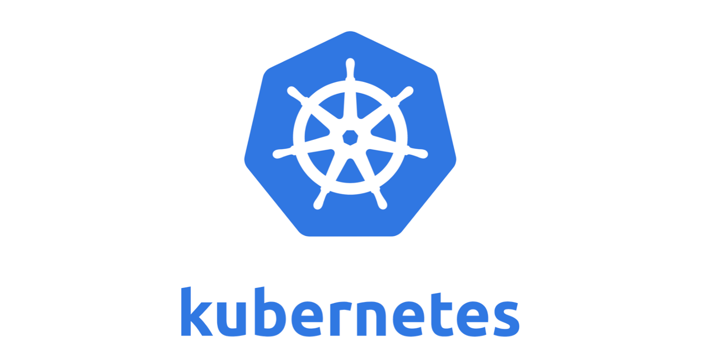
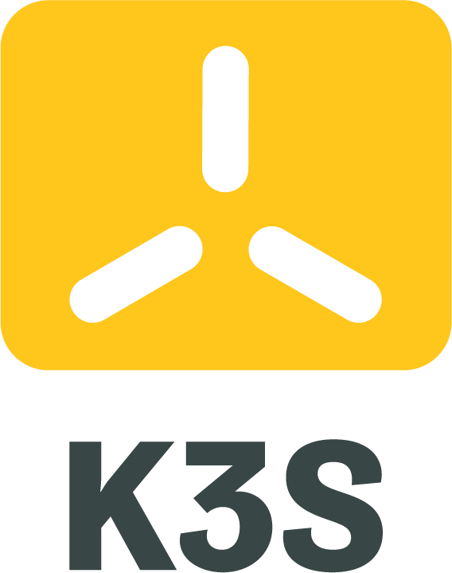
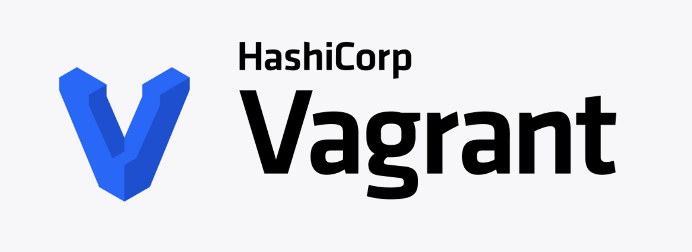
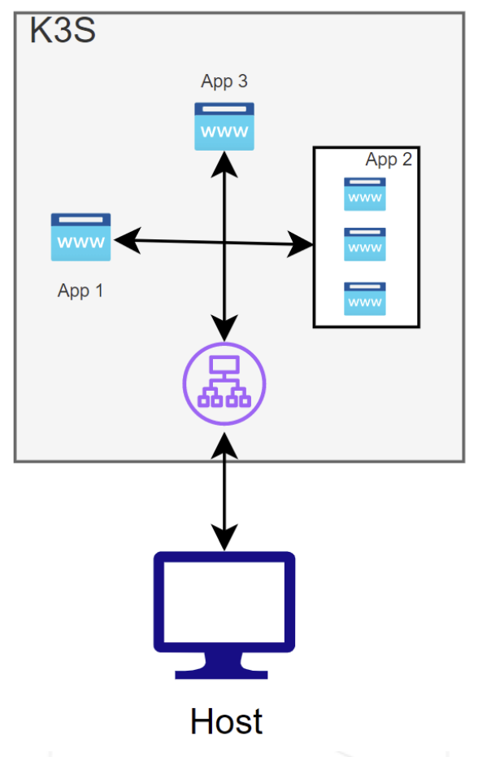

# Inception-of-Things

  
  
  
  
  

> This project aims to deepen your knowledge by making you use K3d and K3s with
Vagrant. You will learn how to set up a personal virtual machine with Vagrant and CentOS. Then, you will learn how to use K3s and its Ingress. Last but not least, you will discover K3d that will simplify your life. These steps will get you started with Kubernetes.

## P1

We need to create two virtual machines using Vagrant with exact parameters that will build a k3s cluster with one server and one worker node.

## P2

We need to create a virtual machine using Vagrant with exact parameters that will be a server node in a k3s cluster with five applications pods that will be selected by "Host" header:

  

## P3

We need to create a virtual machine without Vagrant where we will start a k3d cluster with two namespaces argocd and dev where inside of argocd we will start an argocd agent that will pull changes from a public github repository.

## Bonus

We need to make the same task as we had in p3 using a gitlab repository that we need to run locally:

> The latest version available of Gitlab from the official website is expected.

Note: it requires too much resources so p3 part in bonus is done on host (not on VM).

## Grade
100/100