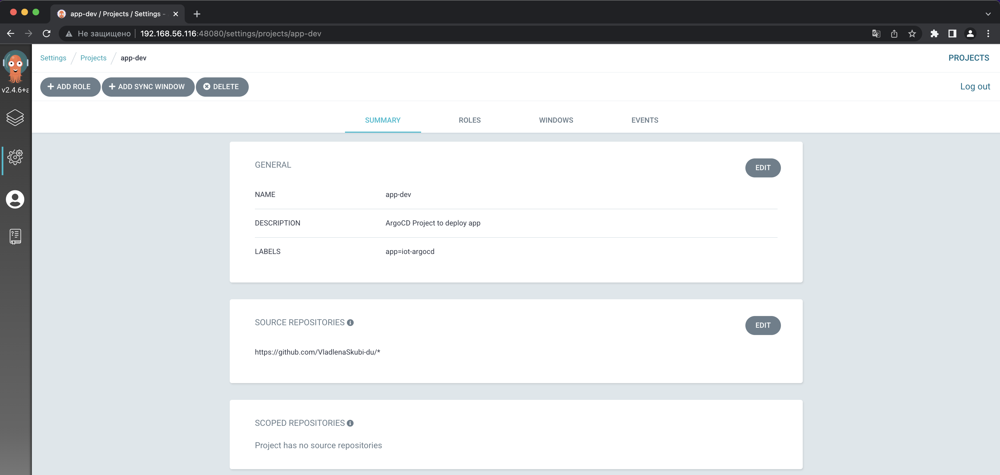
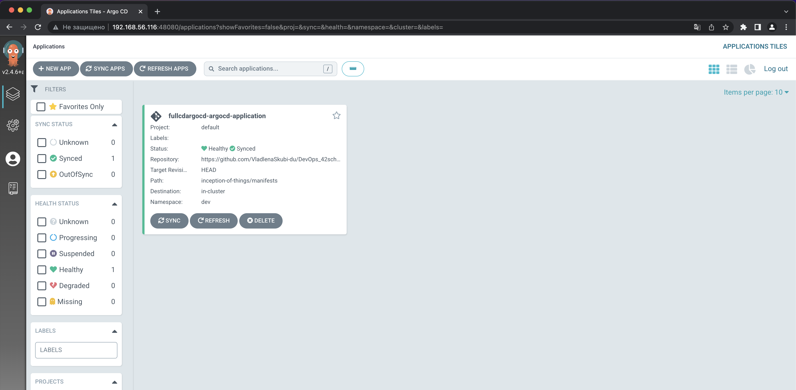
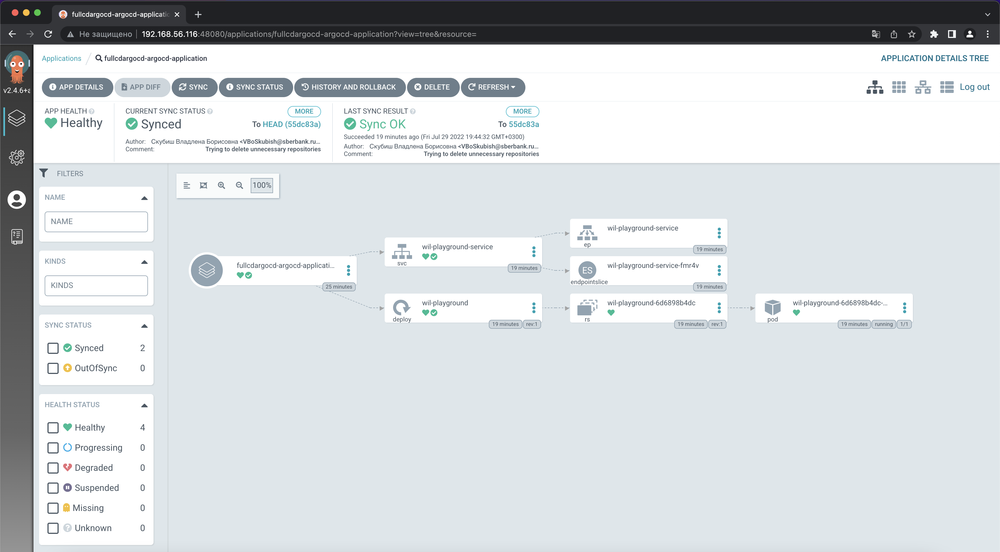
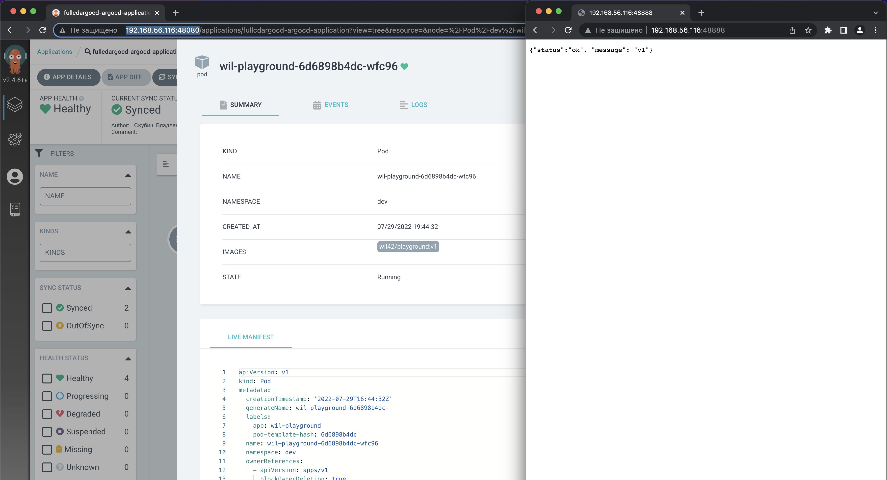

# ArgoCD

!Requires resources for all the ArgoCD pods creation. For example before stopping most "heavy" processes on Mac OS:

        % kubectl get pods -n argocd
        NAME                                               READY   STATUS            RESTARTS   AGE
        argocd-redis-896595fb7-mv55m                       1/1     Running           0          13m
        argocd-server-665585dbcd-vf57z                     0/1     Running           0          13m
        argocd-notifications-controller-6f8f44d4bb-dmkdv   1/1     Running           0          13m
        argocd-applicationset-controller-c975f8bc5-kjtxq   1/1     Running           0          13m
        argocd-dex-server-6bc6778ccd-5v82k                 0/1     PodInitializing   0          13m
        argocd-repo-server-6554c986cd-hlg46                0/1     Running           0          13m
        argocd-application-controller-0                    1/1     Running           0          13m

In order to perform the task we get:\
  1. K3D cluster running on VM:

                [sschmele@localhost confs]$ kubectl cluster-info
                Kubernetes control plane is running at https://0.0.0.0:34742
                CoreDNS is running at https://0.0.0.0:34742/api/v1/namespaces/kube-system/services/kube-dns:dns/proxy
                Metrics-server is running at https://0.0.0.0:34742/api/v1/namespaces/kube-system/services/https:metrics-server:https/proxy

  2. ArgoCD infrastructure within the cluster:

                % kubectl get all -n argocd
                NAME                                                   READY   STATUS    RESTARTS   AGE
                pod/argocd-redis-896595fb7-mv55m                       1/1     Running   0          31m
                pod/argocd-notifications-controller-6f8f44d4bb-dmkdv   1/1     Running   0          31m
                pod/argocd-applicationset-controller-c975f8bc5-kjtxq   1/1     Running   0          31m
                pod/argocd-application-controller-0                    1/1     Running   0          31m
                pod/argocd-repo-server-6554c986cd-hlg46                1/1     Running   0          31m
                pod/argocd-server-665585dbcd-vf57z                     1/1     Running   0          31m
                pod/argocd-dex-server-6bc6778ccd-5v82k                 1/1     Running   0          31m

                NAME                                              TYPE        CLUSTER-IP      EXTERNAL-IP   PORT(S)                      AGE
                service/argocd-applicationset-controller          ClusterIP   10.43.5.240     <none>        7000/TCP,8080/TCP            31m
                service/argocd-dex-server                         ClusterIP   10.43.198.61    <none>        5556/TCP,5557/TCP,5558/TCP   31m
                service/argocd-metrics                            ClusterIP   10.43.98.112    <none>        8082/TCP                     31m
                service/argocd-notifications-controller-metrics   ClusterIP   10.43.12.126    <none>        9001/TCP                     31m
                service/argocd-redis                              ClusterIP   10.43.7.78      <none>        6379/TCP                     31m
                service/argocd-repo-server                        ClusterIP   10.43.204.218   <none>        8081/TCP,8084/TCP            31m
                service/argocd-server                             ClusterIP   10.43.132.247   <none>        80/TCP,443/TCP               31m
                service/argocd-server-metrics                     ClusterIP   10.43.18.98     <none>        8083/TCP                     31m

                NAME                                               READY   UP-TO-DATE   AVAILABLE   AGE
                deployment.apps/argocd-redis                       1/1     1            1           31m
                deployment.apps/argocd-notifications-controller    1/1     1            1           31m
                deployment.apps/argocd-applicationset-controller   1/1     1            1           31m
                deployment.apps/argocd-repo-server                 1/1     1            1           31m
                deployment.apps/argocd-server                      1/1     1            1           31m
                deployment.apps/argocd-dex-server                  1/1     1            1           31m

                NAME                                                         DESIRED   CURRENT   READY   AGE
                replicaset.apps/argocd-redis-896595fb7                       1         1         1       31m
                replicaset.apps/argocd-notifications-controller-6f8f44d4bb   1         1         1       31m
                replicaset.apps/argocd-applicationset-controller-c975f8bc5   1         1         1       31m
                replicaset.apps/argocd-repo-server-6554c986cd                1         1         1       31m
                replicaset.apps/argocd-server-665585dbcd                     1         1         1       31m
                replicaset.apps/argocd-dex-server-6bc6778ccd                 1         1         1       31m

                NAME                                             READY   AGE
                statefulset.apps/argocd-application-controller   1/1     31m

  3. Running application that ArgoCD agent takes control of according to appllication config files:

                % kubectl get all -n dev
                NAME                                  READY   STATUS    RESTARTS   AGE
                pod/wil-playground-6d6898b4dc-wfc96   1/1     Running   0          16m

                NAME                             TYPE        CLUSTER-IP      EXTERNAL-IP   PORT(S)    AGE
                service/wil-playground-service   ClusterIP   10.43.123.240   <none>        8888/TCP   16m

                NAME                             READY   UP-TO-DATE   AVAILABLE   AGE
                deployment.apps/wil-playground   1/1     1            1           16m

                NAME                                        DESIRED   CURRENT   READY   AGE
                replicaset.apps/wil-playground-6d6898b4dc   1         1         1       16m

As a result you can see your project in UI of ArgoCD server:

  
  
  
  

And if we change application version in github repository:

  
